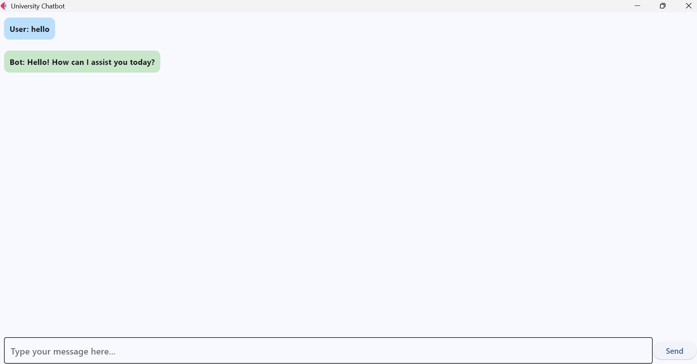
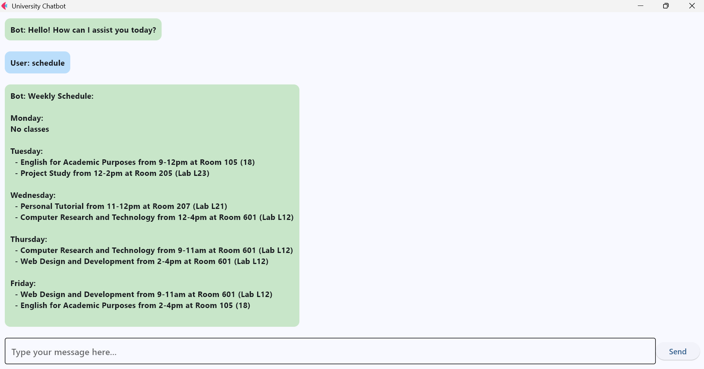
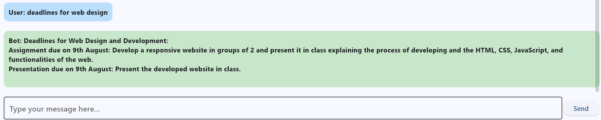
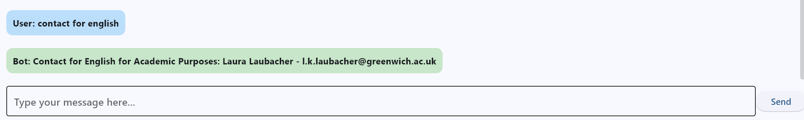

# University Assistant Chatbot

A desktop chatbot application built with Python and Flet, designed to help university students quickly access course information, schedules, deadlines, and contact details. Features a clean chat interface with real-time responses.



## Overview

This chatbot serves as a virtual assistant for University of Greenwich students, providing instant access to:
- Weekly class schedules with room numbers
- Assignment deadlines for all courses
- Professor contact information
- Course-specific queries

Built as a proof-of-concept for improving student access to academic information.

## Features

- **Interactive Chat Interface**: Clean, modern UI with message bubbles
- **Natural Language Processing**: Understands casual queries like "when is english class?" or "contact for web design"
- **Comprehensive Data Coverage**: Includes schedules, deadlines, and contacts for 5 courses
- **Real-time Responses**: Instant answers without external API calls
- **Desktop Application**: Runs locally using Flet framework

## Screenshots

### Chat Interface


### Schedule Query


### Deadline Information


### Contact Lookup


## Tech Stack

**Language:** Python 3.10+  
**UI Framework:** Flet (Python desktop UI framework)  
**Data Storage:** In-memory dictionaries (for prototype)  
**Architecture:** Event-driven chat interface

## Installation & Setup

### Prerequisites
- Python 3.10 or higher
- pip package manager

### Install Dependencies
```bash
# Clone the repository
cd flet_chatbot

# Install required packages
pip install flet
```

### Run the Application
```bash
python chatbot.py
```

A window will open with the chatbot interface ready to use.

## Usage Examples

**Get your weekly schedule:**
```
User: schedule
Bot: [Displays full weekly timetable with times and rooms]
```

**Find assignment deadlines:**
```
User: deadlines for web design
Bot: Assignment due on 9th August: Develop a responsive website...
     Presentation due on 9th August: Present the developed website...
```

**Get professor contact:**
```
User: contact for english
Bot: Contact for English for Academic Purposes: Laura Laubacher - l.k.laubacher@greenwich.ac.uk
```

**Check specific day schedule:**
```
User: what's on thursday?
Bot: Thursday Schedule:
     - Computer Research and Technology from 9-11am at Room 601 (Lab L12)
     - Web Design and Development from 2-4pm at Room 601 (Lab L12)
```

## Data Structure

The chatbot uses three main data dictionaries:

### Schedules
```python
schedules = {
    "Monday": "No classes",
    "Tuesday": [
        {"subject": "English for Academic Purposes", "time": "9-12pm", "room": "Room 105 (18)"},
        {"subject": "Project Study", "time": "12-2pm", "room": "Room 205 (Lab L23)"}
    ],
    # ... additional days
}
```

### Deadlines
Organized by course with assignment types, dates, and descriptions.

### Contacts
Professor names and email addresses for each course.

## How It Works

1. **User Input**: Type a question in the text field
2. **Query Processing**: `handle_query()` function parses the message
3. **Keyword Matching**: Searches for relevant keywords (schedule, deadline, contact, course names)
4. **Response Generation**: Returns formatted information from data dictionaries
5. **UI Update**: Displays response in chat bubble format

## Key Features Demonstrated

### Flet UI Components
- `ft.Column` for scrollable chat history
- `ft.Container` for styled message bubbles
- `ft.TextField` for user input
- `ft.ElevatedButton` for send action

### Natural Language Understanding
- Keyword mapping (e.g., "eap" → "English for Academic Purposes")
- Case-insensitive query handling
- Multiple keyword variations support

### User Experience
- Color-coded messages (blue for user, green for bot)
- Auto-scroll to latest message
- Clean, distraction-free interface

## Project Structure
```
flet_chatbot/
├── chatbot.py          # Main application with UI and logic
├── data.py             # Static data (schedules, deadlines, contacts)
├── dicts.py            # Alternative data structure
├── main.py             # Alternative UI implementation
├── screenshots/        # Application screenshots
│   ├── chatbot-welcome.png
│   ├── chatbot-schedule.png
│   ├── chatbot-deadlines.png
│   └── chatbot-contact.png
└── README.md          # This file
```

## What I Learned

**Python Flet Framework:**
- Building desktop UIs with Python
- Event handling and state management
- Dynamic UI updates with page.update()

**User Interface Design:**
- Chat bubble layouts
- Scrollable content containers
- Input field and button interactions

**Data Organization:**
- Structuring nested dictionaries for complex data
- Keyword mapping for natural language understanding
- Query parsing and response formatting

**Software Architecture:**
- Separation of UI and logic
- Event-driven programming patterns
- Modular function design

## Limitations & Future Improvements

**Current Limitations:**
- Data is hardcoded (not connected to university systems)
- No user authentication
- Limited to predefined queries
- English language only

**Planned Enhancements:**
- [ ] Connect to university API for real-time data
- [ ] Add user authentication and personalized schedules
- [ ] Implement AI-based natural language understanding (NLP)
- [ ] Multi-language support with translation
- [ ] Export chat history feature
- [ ] Push notifications for upcoming deadlines
- [ ] Mobile app version (Flutter)
- [ ] Database integration for persistent data
- [ ] Admin panel for updating information

## Technical Challenges Solved

1. **Dynamic UI Updates**: Used Flet's `page.update()` to refresh chat display after each message
2. **Keyword Ambiguity**: Created mapping system to handle abbreviations and variations
3. **Data Formatting**: Structured responses to be readable in chat format
4. **User Input Validation**: Handled empty messages and unknown queries gracefully

## Use Cases

- **Students**: Quick access to schedules without logging into multiple systems
- **Study Groups**: Coordinating meeting times based on free periods
- **Deadline Management**: Checking upcoming assignments across all courses
- **Professor Communication**: Finding contact details instantly

## Academic Context

**Course**: Project Study (RESE-1160)  
**Institution**: University of Greenwich  
**Year**: 2023-2024  
**Purpose**: Prototype for improving student information access

## License

Academic project for educational purposes.

## Contact

**Francisco Navarro**  
Email: frannavarrogil@gmail.com  
GitHub: [@franng95](https://github.com/franng95)  
LinkedIn: [franjng](https://linkedin.com/in/franjng)

---

**Note**: This is a prototype with sample data from Term 3, 2023. Data is not connected to live university systems. For actual course information, refer to official university portals.